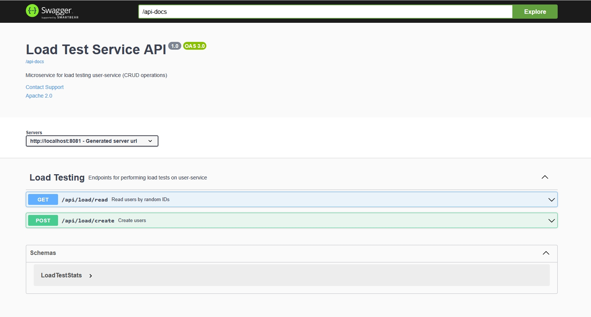
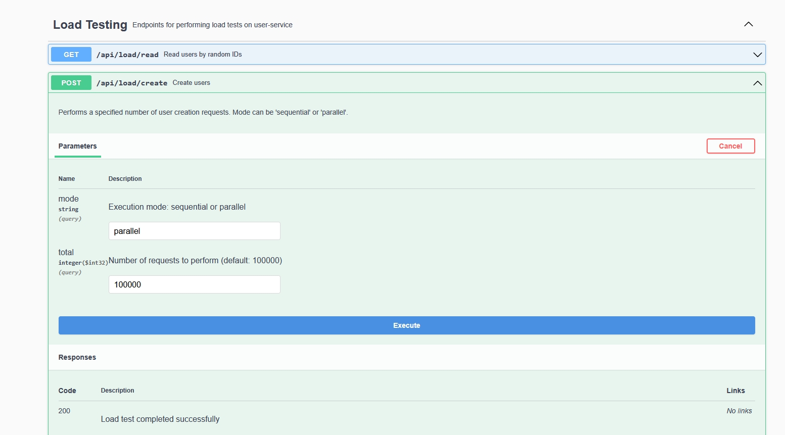
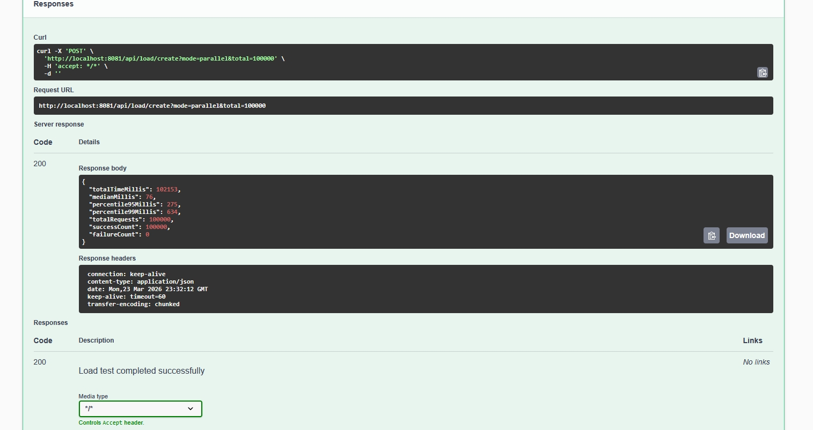
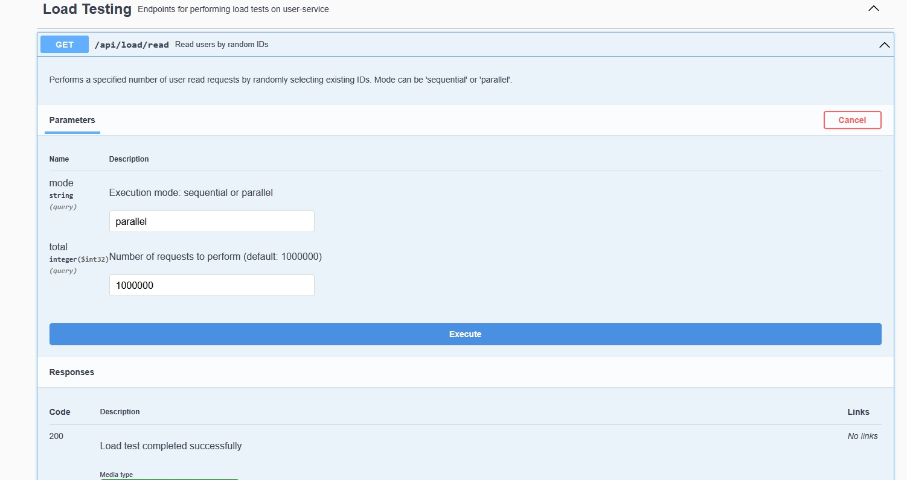
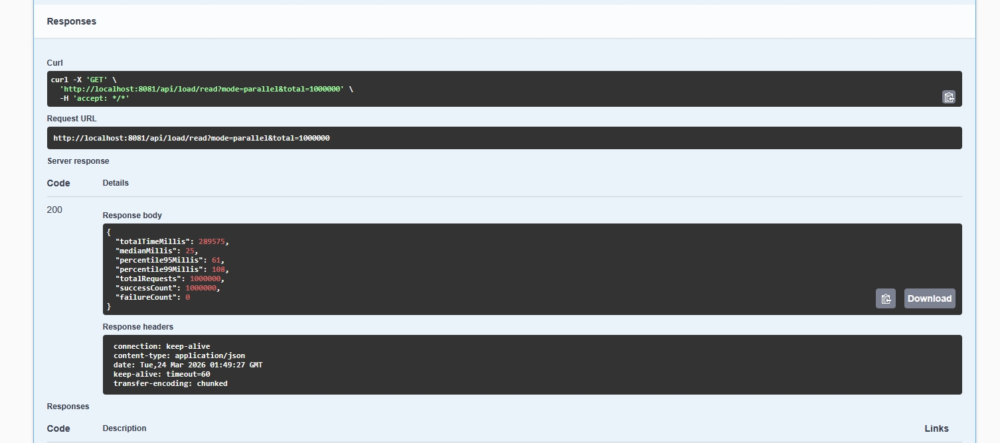

🚀 Load Test Service

Микросервис для нагрузочного тестирования user-service, позволяющий выполнять массовые операции создания и чтения пользователей в разных режимах (sequential / parallel).
Проект создан для анализа производительности, сравнения стратегий выполнения и сбора статистики.

📌 Возможности

✔ Нагрузочное тестирование создания пользователей

    Последовательный режим

    Параллельный режим

    Настраиваемое количество запросов

✔ Нагрузочное тестирование чтения пользователей

    Случайный выбор существующих ID

    Sequential / Parallel режимы

    Автоматический сбор статистики
    

✔ Поддержка Swagger / OpenAPI

Автоматическая документация доступна по адресу:

## **http://localhost:8080/swagger-ui/index.html**



🧱 Архитектура
```
##load-test-service
 ├── controller
 │     └── LoadController.java        # REST API
 ├── service
 │     ├── LoadExecutor               # Стратегия выполнения
 │     ├── SequentialLoadExecutor     # Последовательный режим
 │     ├── ParallelLoadExecutor       # Параллельный режим
 │     └── operation
 │           ├── CreateOperationImpl  # Логика создания
 │           └── ReadOperationImpl    # Логика чтения
 ├── model
 │     └── LoadTestStats              # Статистика выполнения
 └── dto
       └── UserResponseDto
```

⚙️ Конфигурация

application.properties

load.requests=100000
user.service.url=http://localhost:8081

Параметры

| Параметр | Описание | Значение по умолчанию |
| --- | --- | --- |
| ``load.requests`` | Количество запросов, если не указано явно | 100000 |
| ``user.service.url`` | URL user-service | http://localhost:8081 |


🧪 REST API

▶ Создание пользователей

POST /api/load/create

Параметры:

    mode — sequential или parallel

    total — количество запросов

Пример:

## **curl -X POST "http://localhost:8080/api/load/create?mode=parallel&total=50000"**





▶ Чтение пользователей

GET /api/load/read

Параметры:

    mode — sequential или parallel

    total — количество запросов

Пример:

## **curl "http://localhost:8080/api/load/read?mode=sequential&total=100000"**





🧵 Режимы выполнения

Sequential

Один запрос → ожидание ответа → следующий запрос.
Используется для оценки минимальной скорости API.

Parallel

Запросы отправляются одновременно (через ExecutorService).
Используется для стресс‑тестирования.

🧰 Запуск проекта

Локально ## **./mvnw spring-boot:run**


🧪 Тестирование

Проект содержит unit‑тесты для:

    операций чтения и создания

    стратегий выполнения

    контроллера

Запуск:

## **./mvnw test**

🛠 Используемые технологии

    Java 17

    Spring Boot

    Spring Web

    Swagger / OpenAPI

    JUnit 5

    Mockito

    ExecutorService
